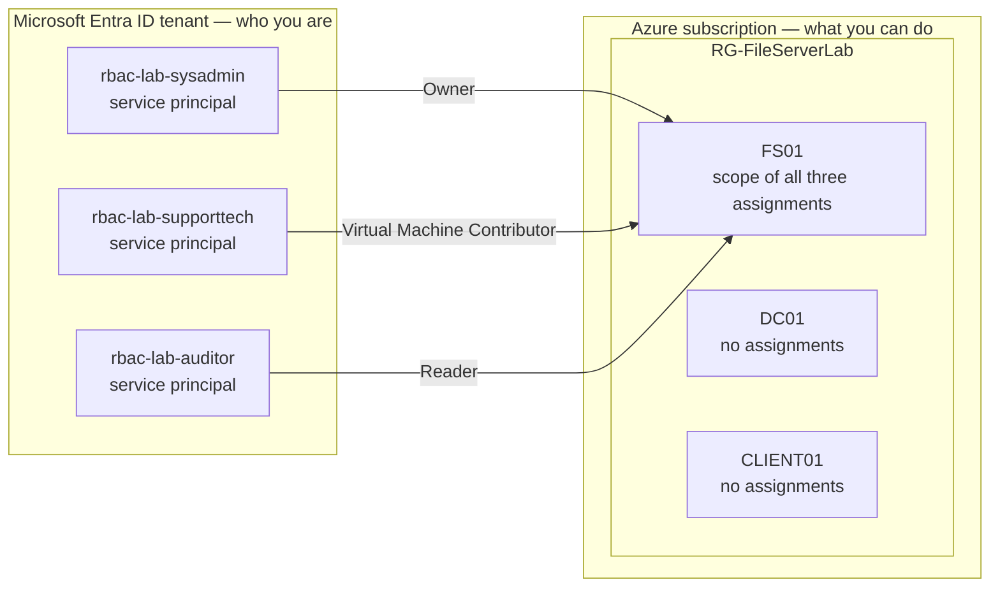

# Azure RBAC Lab — Scoped Access to a Single VM

Three identities, three roles, one virtual machine. This lab uses Azure RBAC (Role-Based Access Control) to decide who can manage a file server **from Azure** — who can view it, restart it, or change who else has access — and then proves the rules are enforced by signing in as each identity and trying.

This is Lab 2 of a three-part Azure series: **NTFS File Server → RBAC → Azure Update Manager.** It builds on the FS01 file server from Lab 1 (`azure-ntfs-file-server-lab`) and deploys no infrastructure of its own.

## Why this lab

Lab 1 controlled access to the **data inside** the server: Active Directory users and groups, enforced by NTFS permissions on a file share. This lab controls access to **the server itself** in Azure: Entra ID identities, enforced by Azure RBAC.

They're separate systems with separate identities, and neither one covers for the other. The Auditor in this lab has Reader on FS01 and still can't open a single file in `\\FS01\CompanyData\Finance`. David from Lab 1 has Full Control on the HR folder and can't restart FS01 from Azure. A real environment needs both locks.

The business scenario: a help desk technician needs to restart an unresponsive file server without being able to delete it or hand out access. An auditor needs to see its configuration without being able to touch it. A senior admin needs full control — of this server, not the whole environment. That's least privilege, applied at the cloud infrastructure layer.

## Architecture



The tenant authenticates — it proves who an identity is. Azure RBAC authorizes — it decides what that identity may do to a resource. A role assignment is the only thing connecting the two.

| Persona | Identity | Role | Scope |
|---|---|---|---|
| SysAdmin | `rbac-lab-sysadmin` | Owner | FS01 only |
| SupportTech | `rbac-lab-supporttech` | Virtual Machine Contributor | FS01 only |
| Auditor | `rbac-lab-auditor` | Reader | FS01 only |

### Scope is the most important line in the lab

Every role assignment answers two questions: **what** (the role) and **where** (the scope). Permissions flow downward:

```
Subscription        /subscriptions/<sub-id>
  └ Resource group    .../resourceGroups/RG-FileServerLab
      └ Resource        .../virtualMachines/FS01      ← all three assignments stop here
```

Scope the Owner role at the resource group and SysAdmin silently owns DC01, CLIENT01, the Key Vault, and the network too. Same three lines of Terraform, wildly different blast radius. Scoped to FS01's resource ID, even Owner can't see DC01 — confirmed below.

## What's inside

```
azure-rbac-access-control-lab/
├── backend.tf                  ← reuses Lab 1's state storage, separate state key
├── versions.tf                 ← Terraform ≥ 1.5.0, azurerm ~> 3.100
├── variables.tf                ← the three object IDs have NO defaults, on purpose
├── data.tf                     ← reads Lab 1's resource group and FS01 without owning them
├── rbac.tf                     ← the three role assignments
├── outputs.tf
├── terraform.tfvars.example    ← copy to terraform.tfvars (gitignored)
├── validate-lab.ps1            ← checks live assignments against terraform.tfvars
└── scripts/
    └── 01-create-service-principals.ps1
```

## Why service principals, not users

The SOP this lab is based on assumed three human test accounts. Two things changed that:

1. **Lab 1's users can't be reused.** `alice.finance` and the others are Active Directory Domain Services accounts that live inside the `lab.local` domain on DC01's disk. Azure has never heard of them. RBAC only assigns roles to **Microsoft Entra ID** identities.
2. **Service principals are how access to automation gets scoped in practice.** A service principal is an application's identity. It signs in with a client secret, so persona testing needs no browser and no MFA (Multi-Factor Authentication) prompts.

### appId vs objectId

Creating a service principal produces two GUIDs, and mixing them up is the most common way this lab fails:

- **appId** identifies the *app registration* — the global definition of the application. It's what you sign in *as*.
- **objectId** identifies the *service principal* — that application's identity inside this tenant. It's the only thing that can hold a role, so it's what `principal_id` in `rbac.tf` needs.

Put an appId into `terraform.tfvars` and Azure returns `PrincipalNotFound` — but only after the provider retries for several minutes (a genuinely new principal often hasn't replicated yet), and the error reads like a typo rather than the wrong kind of ID.

## Deploying it

Prerequisites: Lab 1 deployed, Azure CLI, Terraform ≥ 1.5.0, PowerShell with `RemoteSigned` execution policy.

```powershell
az login

# 1. Create the three service principals (no roles yet — Terraform grants them).
#    Client secrets go straight into Lab 1's Key Vault, never to the screen.
.\scripts\01-create-service-principals.ps1

# 2. Paste the three printed object IDs into terraform.tfvars
Copy-Item terraform.tfvars.example terraform.tfvars

# 3. Deploy
terraform init
terraform plan     # must show exactly 3 to add — anything more means a name/case mismatch with Lab 1
terraform apply
```

Role assignments are free and deploy in about 25 seconds. The Lab 1 VMs don't need to be running for any of this — Azure checks authorization before it checks power state.

## Verification

Two separate claims, checked two separate ways.

### 1. Do the assignments exist? — `validate-lab.ps1`

`terraform apply` reports what Terraform *sent*. The validation script asks Azure what it's *holding*: each expected role, on the expected principal (read from `terraform.tfvars`), directly on FS01 — and nothing else assigned there.

```powershell
.\validate-lab.ps1
```

### 2. Are they enforced? — persona testing

A list of role assignments is a list of who's been given keys. It doesn't prove the locks work. That takes signing in **as** each identity and trying the doors.

Run this in a separate terminal. `az` stores its login per user profile, not per terminal, so without `AZURE_CONFIG_DIR` signing in as a service principal would switch every open terminal to it.

```powershell
# As yourself: fetch secrets first — the service principals can't read Key Vault
$tenant         = "<tenant-id>"
$auditorSecret  = az keyvault secret show --vault-name <vault> --name rbac-lab-auditor-secret     --query value -o tsv
$supportSecret  = az keyvault secret show --vault-name <vault> --name rbac-lab-supporttech-secret --query value -o tsv
$sysadminSecret = az keyvault secret show --vault-name <vault> --name rbac-lab-sysadmin-secret    --query value -o tsv

# Isolate this terminal's login
$env:AZURE_CONFIG_DIR = "$HOME\.azure-rbac-test"

# Sign in as a persona (appId, not objectId)
az login --service-principal --username <auditor-appId> "--password=$auditorSecret" --tenant $tenant
```

#### Results

| Test | Auditor (Reader) | SupportTech (VM Contributor) | SysAdmin (Owner) |
|---|---|---|---|
| Read FS01 | ✅ Allowed | | |
| Restart FS01 | ❌ Denied — role | ✅ Allowed | |
| Grant itself Owner on FS01 | | ❌ Denied — role | |
| Grant a role on FS01 | | | ✅ Allowed (then removed) |
| Read DC01 | ❌ Denied — scope | | ❌ Denied — scope |

Every denial came back from Azure as `AuthorizationFailed`. Reading the **action** and **scope** in the error tells you *why*:

```
does not have authorization to perform action
'Microsoft.Compute/virtualMachines/restart/action' over scope '.../virtualMachines/FS01'
```
Inside the scope, but the **role** doesn't include restart.

```
does not have authorization to perform action
'Microsoft.Compute/virtualMachines/read' over scope '.../virtualMachines/DC01'
```
The role *does* include read — but DC01 is outside the **scope**. This one came back identically for the Owner.

```
does not have authorization to perform action
'Microsoft.Authorization/roleAssignments/write' over scope '.../FS01/providers/Microsoft.Authorization/...'
```
SupportTech attempting to make itself Owner. Virtual Machine Contributor can operate, resize, and even delete the VM, but its Authorization permissions are read-only: **managing a resource and managing access to it are separate permissions.**

Every error also names both identifiers — `The client '<appId>' with object id '<objectId>'` — the identity it signed in as, and the one that holds the role.

After testing: `az logout`, `Remove-Variable` the secrets, `Remove-Item Env:AZURE_CONFIG_DIR`, delete `$HOME\.azure-rbac-test`, and confirm with `az account show` that you're yourself again.

## Design decision: a separate Terraform project

Lab 2 has its own folder and its own state file (`rbac-lab.tfstate`) rather than adding `rbac.tf` to Lab 1. I briefly merged them — it would have been simpler, and `rbac.tf` could reference FS01 directly instead of through a data source — then reverted for three reasons:

- **Blast radius of `terraform destroy`.** In a shared state, there's no way to remove just the access layer; destroy takes the VMs with it. Separately, destroy here removes three role assignments and nothing else.
- **Different lifecycles.** Infrastructure changes rarely. Access changes constantly. Coupling them means every access change runs a plan against production infrastructure.
- **The data-source pattern.** Reading another project's resources without owning them is how one team's Terraform safely references another's — and it can only be practiced when the projects are actually separate.

The tradeoff is real: Terraform can no longer see the dependency between the two projects, and `data.tf` fails if Lab 1 isn't deployed.

## Where the source SOP was wrong

The SOP printed a permission matrix and expected results that don't match Azure's actual role definitions. Checked against `az role definition list`:

- **Virtual Machine Contributor can delete the VM.** Its actions include `Microsoft.Compute/virtualMachines/*`. The SOP said it couldn't.
- **"Connect via RDP" isn't an RBAC permission.** RDP access is decided by the network security group and Windows' Remote Desktop Users group (Lab 1), not Azure roles.
- **SupportTech can list role assignments.** Virtual Machine Contributor includes `Microsoft.Authorization/*/read`. The SOP expected that to fail. What it can't do is *write* them — the escalation test above.
- **The SOP's validation script only matched role names**, so a Reader assigned to the wrong principal would still pass, and its permission matrix was hardcoded text that tested nothing. `validate-lab.ps1` here matches each role to its exact principal and scope, and leaves enforcement to the persona tests.

## Troubleshooting log

Real problems hit while building this — the wrong turns included, because a writeup that only shows the clean path teaches less.

- **Lab 1's users don't exist to Azure.** AD DS accounts in `lab.local` can't be assigned Azure roles. Switched to Entra ID service principals.
- **Guest in my own tenant.** My account shows as `…#EXT#@…onmicrosoft.com` — a guest, because the tenant was auto-created when I signed up for Azure with a Gmail address. Subscription rights were strong; directory rights were uncertain. Service principals sidestepped it.
- **`az login` froze after picking an account.** The Windows Web Account Manager sign-in stalled inside VS Code. Fix: `az config set core.enable_broker_on_windows=false` for browser sign-in.
- **"Running scripts is disabled on this system."** Windows client defaults to the `Restricted` execution policy. Fix: `Set-ExecutionPolicy -Scope CurrentUser -ExecutionPolicy RemoteSigned`. Execution policy is a guardrail against accidents, not a security boundary.
- **A client secret silently failed to save — and the script said it succeeded.** On the first service principal, `az ad app credential reset` returned nothing (likely replication lag right after creation), so `az keyvault secret set` failed with `argument --value: expected one argument`. The next line printed `stored in Key Vault` anyway, because it ran unconditionally. Caught by listing the vault (three secrets, not four); fixed by resetting that one credential. The script now stops if the secret is empty or the write returns a non-zero exit code.
- **`--tenant` expected one argument.** PowerShell variables exist per terminal; `$tenant` had been set in a different window. Related trap: `az` logins are per user profile, so signing in as a service principal in one terminal switches all of them. Solved with `AZURE_CONFIG_DIR`.
- **A table that looked like success.** Three test commands run at once printed FS01's details first, and at a glance it looked like the Auditor had read DC01. The query itself proved otherwise: command three asked only for `name` as plain text, so it could never have produced a table with a Size column. Run tests one at a time.
- **The principal column vanished.** Listing assignments as the SysAdmin service principal returned roles but no names. Resolving an object ID to a name is a directory lookup, and Owner of a VM has no rights in the directory. RBAC permissions and directory permissions are separate systems.

## Teardown

`terraform destroy` removes the three role assignments and nothing else. The service principals and their secrets were created by the script, not Terraform, so they're cleaned up separately:

```powershell
terraform destroy

az ad app delete --id <sysadmin-appId>
az ad app delete --id <supporttech-appId>
az ad app delete --id <auditor-appId>

az keyvault secret delete --vault-name <vault> --name rbac-lab-sysadmin-secret
az keyvault secret delete --vault-name <vault> --name rbac-lab-supporttech-secret
az keyvault secret delete --vault-name <vault> --name rbac-lab-auditor-secret
```

Key Vault soft-delete keeps deleted secrets recoverable until they're purged or the retention period ends.

## Reflection

The most useful thing this lab taught wasn't a command. It was that "it said it worked" and "it works" are two different claims, and I kept having to separate them — Terraform reporting created, a validation script printing ALL PASS over a table it never tested, my own script announcing a secret was stored when it wasn't. Each time, the fix was the same: go ask the system directly, from the point of view of the thing that's supposed to be allowed or blocked.

The other lesson is that scope beats role. Owner sounds absolute, and it still couldn't see a server one step outside its boundary. When I think about who should have access to what now, the first question isn't which role — it's how far down the path the scope should go.